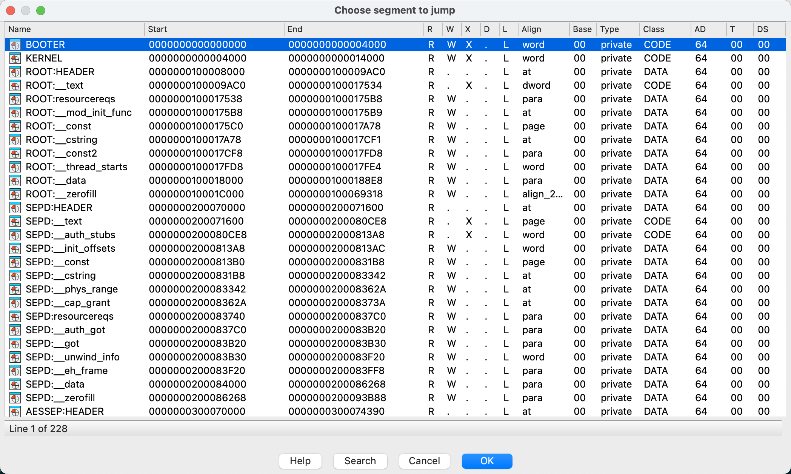

# `SEP` Firmware Loader for `IDA`
`IDA` loader for `SEP` firmware with `dyld` cache support. 

1. Place `sep-fw-dyld-cache-loader.py` into `IDA`'s loader plugin dir.
2. Load the decrypted `SEP` firmware.

# Notes
1. Tested with `IDA` 8.x
2. Sample firmware: [sep-firmware.d37.RELEASE.im4p](https://theapplewiki.com/wiki/Keys:DawnD_21D50_(iPhone15,5))
3. 
